# PLM Database ER Diagram

```mermaid
erDiagram

    %% ══════════════ USER ══════════════
    UserMaster {
        string id PK
        string userid UK
        string email
        string password
        string name
    }
    UserRole {
        string id PK
        string userId FK,UK
        Role role
    }
    UserMaster ||--o| UserRole : "has"

    %% ══════════════ SEASON / COLLECTION ══════════════
    SeasonMaster {
        string id PK
        string name UK
        int seasonCode UK
        string seasonName
        datetime startDate
        datetime endDate
    }
    Collection {
        string id PK
        string name
        string description
        string seasonId FK
    }
    SeasonMaster ||--o{ Collection : "has"

    %% ══════════════ DIVISION ══════════════
    DivisionMaster {
        int id PK
        string name UK
        int divisionCode UK
    }

    %% ══════════════ PRODUCT ══════════════
    Product {
        string id PK
        string styleNumber UK
        string name
        int divisionId FK
        string category
        ProductStatus status
        float targetPrice
        float originalPrice
        int planQty
        string collectionId FK
        string supplierId FK
    }
    Collection ||--o{ Product : "contains"
    DivisionMaster ||--o{ Product : "belongs to"
    Supplier ||--o{ Product : "supplies"

    %% ══════════════ SUPPLIER ══════════════
    Supplier {
        string id PK
        string name
        string contactPerson
        string email
        string phone
        string address
        string country
    }

    %% ══════════════ MATERIAL ══════════════
    Material {
        string id PK
        string materialCode
        string name
        MaterialType type
        MaterialCategory materialCategory
        string composition
        string weight
        string width
        float unitPrice
        string unit
        string originCountry
    }

    %% ══════════════ COLOR ══════════════
    Color {
        string id PK
        string colorCode
        string colorName
        string pantoneCode
        string pantoneName
        string rgbValue
        string colorImage
        ColorType colorType
        int cmykC
        int cmykM
        int cmykY
        int cmykK
        string colorTemperature
    }

    %% ══════════════ MATERIAL-COLOR (M:N) ══════════════
    MaterialColor {
        string id PK
        string materialId FK
        string colorId FK
    }
    Material ||--o{ MaterialColor : "has"
    Color ||--o{ MaterialColor : "used in"

    %% ══════════════ SUPPLIER-MATERIAL (M:N) ══════════════
    SupplierMaterial {
        string id PK
        string supplierId FK
        string materialId FK
        int leadTime
        int moq
        float unitPrice
    }
    Supplier ||--o{ SupplierMaterial : "provides"
    Material ||--o{ SupplierMaterial : "sourced from"

    %% ══════════════ SAMPLE ══════════════
    Sample {
        string id PK
        string sampleName
        string sampleNumber UK
        SampleType sampleType
        SampleStatus status
        string imageUrl
        string mainFactoryCode
        int year
        string division
        string subCategory
        string productId FK
        string seasonId FK
        string supplierId FK
    }
    Product ||--o{ Sample : "has"
    SeasonMaster ||--o{ Sample : "seasonal"
    Supplier ||--o{ Sample : "produced by"

    %% ══════════════ BOM ITEM (Sample-Material M:N) ══════════════
    BomItem {
        string id PK
        string sampleId FK
        string materialId FK
        float quantity
        string unit
        string note
    }
    Sample ||--o{ BomItem : "bill of"
    Material ||--o{ BomItem : "used in"

    %% ══════════════ SAMPLE MATERIAL ══════════════
    SampleMaterial {
        string id PK
        string sampleId FK
        SampleMaterialKind kind
        string materialCode
        string materialName
        float costPerUnit
        string fabricSupplier
    }
    Sample ||--o{ SampleMaterial : "uses"

    %% ══════════════ SAMPLE COLOR (M:N) ══════════════
    SampleColor {
        string id PK
        string sampleId FK
        string colorId FK
        string status
    }
    Sample ||--o{ SampleColor : "colored"
    Color ||--o{ SampleColor : "applied to"

    %% ══════════════ COST ══════════════
    Cost {
        string id PK
        string costVersion
        CostStatus status
        string currency
        decimal fobPrice
        decimal materialCost
        decimal processingCost
        decimal trimCost
        float profitMargin
        int moq
        int leadTimeDays
        string sampleId FK
    }
    Sample ||--o{ Cost : "costed"

    %% ══════════════ SIZE GROUP / SIZE MASTER ══════════════
    SizeGroup {
        string id PK
        string name
        int divisionId FK
        string subCategory
        boolean isActive
        int sortOrder
    }
    SizeMaster {
        string id PK
        string sizeGroupId FK
        string sizeCode
        string sizeName
        int sortOrder
        boolean isActive
    }
    DivisionMaster ||--o{ SizeGroup : "defines"
    SizeGroup ||--o{ SizeMaster : "contains"

    %% ══════════════ SAMPLE MEASUREMENT ══════════════
    SampleMeasurement {
        string id PK
        string sampleId FK
        string sizeMasterId FK
        string sizeCode
        string part
        string value
    }
    Sample ||--o{ SampleMeasurement : "measured"
    SizeMaster ||--o{ SampleMeasurement : "size ref"

    %% ══════════════ MILESTONE / PROGRESS ══════════════
    Milestone {
        string id PK
        string name
        string description
        int sortOrder
        boolean isActive
    }
    SampleMilestoneProgress {
        string id PK
        string sampleId FK
        string milestoneId FK
        boolean completed
        datetime completedAt
        string note
    }
    Sample ||--o{ SampleMilestoneProgress : "tracks"
    Milestone ||--o{ SampleMilestoneProgress : "progress of"

    %% ══════════════ SCHEDULE ══════════════
    Schedule {
        string id PK
        date scheduleDate UK
        string note
    }
    ScheduleMilestoneAssignment {
        string id PK
        string scheduleId FK
        string milestoneId FK
    }
    Schedule ||--o{ ScheduleMilestoneAssignment : "assigns"
    Milestone ||--o{ ScheduleMilestoneAssignment : "scheduled"

    %% ══════════════ SAMPLE COMMENT ══════════════
    SampleComment {
        string id PK
        string sampleId FK
        string userId
        string userName
        string comment
    }
    Sample ||--o{ SampleComment : "discussed"

    %% ══════════════ TREND ITEM ══════════════
    TrendItem {
        string id PK
        string title
        string url
        string imageUrl
        string seasonId FK
    }
    SeasonMaster ||--o{ TrendItem : "trends"

    %% ══════════════ OTB PLANNING ══════════════
    OtbPlanning {
        string id PK
        string styleNumber
        string styleName
        string category
        int season
        int weekNumber
        int year
        int salesQty
        int otb
    }

    %% ══════════════ FINANCIAL PLANNING ══════════════
    FinancialPlanning {
        string id PK
        int year
        int seasonCode
        string divisionName
        int month
        float revenue
        float gmPercent
    }

    %% ══════════════ PRODUCT REVIEW ══════════════
    ProductReview {
        string id PK
        string reviewId UK
        string sku
        string articleNumber
        string productName
        string reviewText
        int rating
        string status
        string channel
    }

    %% ══════════════ QUALITY INSPECTION ══════════════
    QualityInspection {
        string id PK
        string sampleId FK
        string inspectionType
        datetime inspectionDate
        string inspector
        QualityResult overallResult
        QualityInspectionStatus status
    }
    Sample ||--o{ QualityInspection : "inspected"

    QualityInspectionItem {
        string id PK
        string inspectionId FK
        string category
        string itemName
        string standard
        string actualValue
        QualityResult result
    }
    QualityInspection ||--o{ QualityInspectionItem : "checks"

    QualityPhoto {
        string id PK
        string inspectionId FK
        string imageUrl
        string caption
        string photoType
    }
    QualityInspection ||--o{ QualityPhoto : "photos"

    QualityCareLabel {
        string id PK
        string inspectionId FK
        CareLabelCategory category
        string symbolCode
        string symbolName
        string symbolSvg
    }
    QualityInspection ||--o{ QualityCareLabel : "care labels"
```

## Entity Summary

| Domain | Tables | Description |
|--------|--------|-------------|
| **User** | UserMaster, UserRole | Authentication and role management |
| **Season** | SeasonMaster, Collection | Seasonal planning and collection grouping |
| **Product** | Product, DivisionMaster | Product master data with division hierarchy |
| **Sample** | Sample, SampleColor, SampleMaterial, SampleMeasurement, BomItem, Cost | Sample development lifecycle |
| **Material** | Material, MaterialColor | Raw materials and fabric management |
| **Supplier** | Supplier, SupplierMaterial | Supplier and sourcing management |
| **Color** | Color | Color palette management (Pantone, CMYK, RGB) |
| **Size** | SizeGroup, SizeMaster | Size grading and measurement standards |
| **Progress** | Milestone, SampleMilestoneProgress, Schedule, ScheduleMilestoneAssignment | Development timeline tracking |
| **Quality** | QualityInspection, QualityInspectionItem, QualityPhoto, QualityCareLabel | Quality control and care labeling |
| **Planning** | OtbPlanning, FinancialPlanning | WSSI/OTB and merchandize financial planning |
| **Other** | TrendItem, ProductReview, SampleComment | Trends, reviews, and communication |

**Total: 33 tables, 10 enums**
