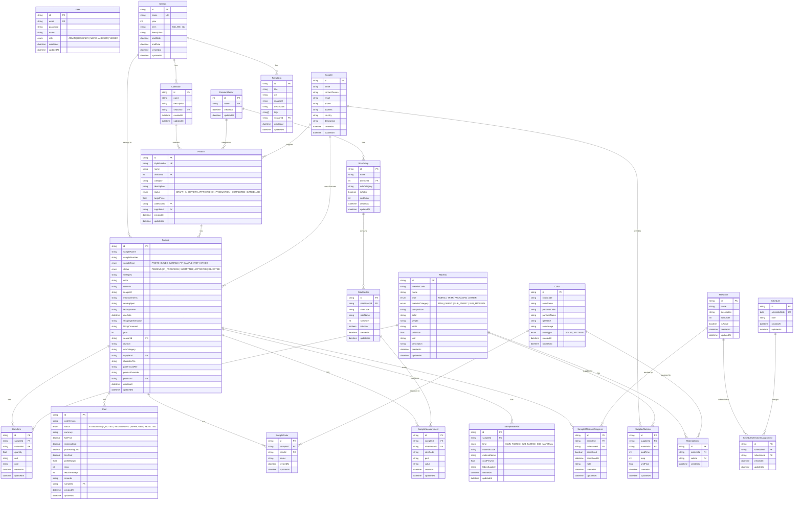

# PLM Database ERD

```mermaid
erDiagram
    User {
        string id PK
        string email UK
        string password
        string name
        enum role "ADMIN | DESIGNER | MERCHANDISER | VIEWER"
        datetime createdAt
        datetime updatedAt
    }

    Season {
        string id PK
        string name UK
        int year
        string term "SS | AW | etc."
        string description
        datetime startDate
        datetime endDate
        datetime createdAt
        datetime updatedAt
    }

    Collection {
        string id PK
        string name
        string description
        string seasonId FK
        datetime createdAt
        datetime updatedAt
    }

    DivisionMaster {
        int id PK
        string name UK
        datetime createdAt
        datetime updatedAt
    }

    Product {
        string id PK
        string styleNumber UK
        string name
        int divisionId FK
        string category
        string description
        enum status "DRAFT | IN_REVIEW | APPROVED | IN_PRODUCTION | COMPLETED | CANCELLED"
        float targetPrice
        string collectionId FK
        string supplierId FK
        datetime createdAt
        datetime updatedAt
    }

    Sample {
        string id PK
        string sampleName
        string sampleNumber
        enum sampleType "PROTO | SALES_SAMPLE | PP_SAMPLE | TOP | OTHER"
        enum status "PENDING | IN_PROGRESS | SUBMITTED | APPROVED | REJECTED"
        string sizeSpec
        string color
        string remarks
        string imageUrl
        string measurements
        string sewingSpec
        string factoryName
        datetime dueDate
        string shippingDestination
        string fittingComment
        int year
        string seasonId FK
        string division
        string subCategory
        string supplierId FK
        string illustratorFile
        string patternCadFile
        string productOverride
        string productId FK
        datetime createdAt
        datetime updatedAt
    }

    Cost {
        string id PK
        string costVersion
        enum status "ESTIMATING | QUOTED | NEGOTIATING | APPROVED | REJECTED"
        string currency
        decimal fobPrice
        decimal materialCost
        decimal processingCost
        decimal trimCost
        float profitMargin
        int moq
        int leadTimeDays
        string remarks
        string sampleId FK
        datetime createdAt
        datetime updatedAt
    }

    Material {
        string id PK
        string materialCode
        string name
        enum type "FABRIC | TRIM | PACKAGING | OTHER"
        enum materialCategory "MAIN_FABRIC | SUB_FABRIC | SUB_MATERIAL"
        string composition
        string color
        string weight
        string width
        float unitPrice
        string unit
        string description
        datetime createdAt
        datetime updatedAt
    }

    BomItem {
        string id PK
        string sampleId FK
        string materialId FK
        float quantity
        string unit
        string note
        datetime createdAt
        datetime updatedAt
    }

    Supplier {
        string id PK
        string name
        string contactPerson
        string email
        string phone
        string address
        string country
        string description
        datetime createdAt
        datetime updatedAt
    }

    SupplierMaterial {
        string id PK
        string supplierId FK
        string materialId FK
        int leadTime
        int moq
        float unitPrice
        datetime createdAt
        datetime updatedAt
    }

    Color {
        string id PK
        string colorCode
        string colorName
        string pantoneCode
        string pantoneName
        string rgbValue
        string colorImage
        enum colorType "SOLID | PATTERN"
        datetime createdAt
        datetime updatedAt
    }

    MaterialColor {
        string id PK
        string materialId FK
        string colorId FK
        datetime createdAt
    }

    SampleColor {
        string id PK
        string sampleId FK
        string colorId FK
        string status
        datetime createdAt
        datetime updatedAt
    }

    SampleMaterial {
        string id PK
        string sampleId FK
        enum kind "MAIN_FABRIC | SUB_FABRIC | SUB_MATERIAL"
        string materialCode
        string materialName
        float costPerUnit
        string fabricSupplier
        datetime createdAt
        datetime updatedAt
    }

    SizeGroup {
        string id PK
        string name
        int divisionId FK
        string subCategory
        boolean isActive
        int sortOrder
        datetime createdAt
        datetime updatedAt
    }

    SizeMaster {
        string id PK
        string sizeGroupId FK
        string sizeCode
        string sizeName
        int sortOrder
        boolean isActive
        datetime createdAt
        datetime updatedAt
    }

    SampleMeasurement {
        string id PK
        string sampleId FK
        string sizeMasterId FK
        string sizeCode
        string part
        string value
        datetime createdAt
        datetime updatedAt
    }

    TrendItem {
        string id PK
        string title
        string url
        string imageUrl
        string description
        string[] tags
        string seasonId FK
        datetime createdAt
        datetime updatedAt
    }

    Milestone {
        string id PK
        string name
        string description
        int sortOrder
        boolean isActive
        datetime createdAt
        datetime updatedAt
    }

    SampleMilestoneProgress {
        string id PK
        string sampleId FK
        string milestoneId FK
        boolean completed
        datetime completedAt
        string note
        datetime createdAt
        datetime updatedAt
    }

    Schedule {
        string id PK
        date scheduleDate UK
        string note
        datetime createdAt
        datetime updatedAt
    }

    ScheduleMilestoneAssignment {
        string id PK
        string scheduleId FK
        string milestoneId FK
        datetime createdAt
        datetime updatedAt
    }

    %% ===== Relationships =====

    Season ||--o{ Collection : "has"
    Season ||--o{ TrendItem : "has"
    Season ||--o{ Sample : "belongs to"

    Collection ||--o{ Product : "contains"

    DivisionMaster ||--o{ Product : "categorizes"
    DivisionMaster ||--o{ SizeGroup : "has"

    Product ||--o{ Sample : "has"

    Sample ||--o{ BomItem : "has"
    Sample ||--o{ Cost : "has"
    Sample ||--o{ SampleColor : "has"
    Sample ||--o{ SampleMeasurement : "has"
    Sample ||--o{ SampleMaterial : "has"
    Sample ||--o{ SampleMilestoneProgress : "tracks"

    Supplier ||--o{ Product : "supplies"
    Supplier ||--o{ Sample : "manufactures"
    Supplier ||--o{ SupplierMaterial : "provides"

    Material ||--o{ BomItem : "used in"
    Material ||--o{ SupplierMaterial : "supplied by"
    Material ||--o{ MaterialColor : "has"

    Color ||--o{ MaterialColor : "assigned to"
    Color ||--o{ SampleColor : "assigned to"

    SizeGroup ||--o{ SizeMaster : "contains"
    SizeMaster ||--o{ SampleMeasurement : "measures"

    Milestone ||--o{ SampleMilestoneProgress : "tracked by"
    Milestone ||--o{ ScheduleMilestoneAssignment : "scheduled in"

    Schedule ||--o{ ScheduleMilestoneAssignment : "assigns"
```
